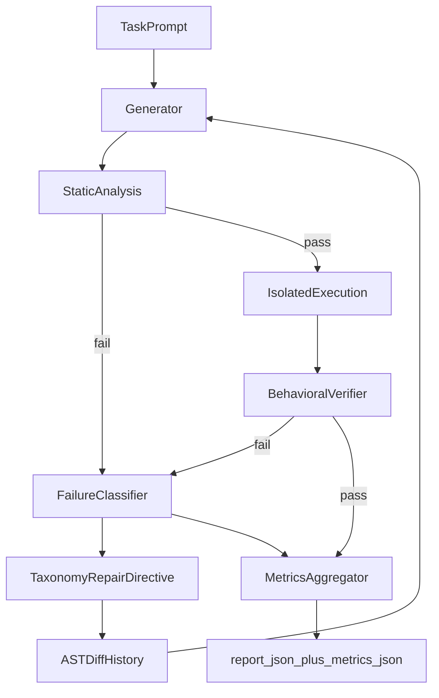

# Automated Self-Correction Loop (ASCL)

**Execution-grounded verified repair engine** · **AGPL-3.0-or-later** · Python 3.11+ · Typer CLI

ASCL is not an LLM retry wrapper. It is a **process-isolated, resource-limited**,
diagnosis-driven repair loop:

**Reasoning → Execution → Observation → Diagnosis → Repair → Verification → Metrics**

An LLM proposes Python; static checks and an isolated subprocess observe the result; a deterministic **failure taxonomy** diagnoses the class of failure; taxonomy-conditioned repair directives + AST-diff history steer the next attempt; rich metrics make reliability measurable.

## Demo: classify → repair → pass

Watch the concept in ~15 seconds (mock provider, no API key):

1. **Terminal recording** — `asciinema play docs/demo/heal-fibonacci.cast`
2. **Transcript** — [docs/demo/heal-fibonacci.md](docs/demo/heal-fibonacci.md)
3. **Artifacts** — [examples/demo/fibonacci-heal/](examples/demo/fibonacci-heal/) (checked-in `report.json` + `metrics.json`)

```bash
bash scripts/regenerate_demo.sh
```

**Iteration 1 diagnosis** (from the checked-in run):

```json
{
  "iteration": 1,
  "failure_class": "assertion",
  "classification_confidence": 0.9,
  "stage": "behavioral",
  "verification_summary": "pytest failed (exit 1)",
  "repair_hint": "Repair strategy: satisfy the failing assertion/test expectation; keep the public API unchanged and prefer a correct algorithm over cosmetic patches."
}
```

**Run metrics** (`examples/demo/fibonacci-heal/metrics.json`):

```json
{
  "iterations": 2,
  "success": true,
  "first_pass_success": false,
  "exit_reason": "success",
  "oscillation_count": 0,
  "failure_class_histogram": { "assertion": 1 },
  "stage_failure_counts": { "behavioral": 1 },
  "prompt_tokens_estimate_total": 829
}
```

Iteration 2 then passes the frozen pytest suite — the full JSON lives in the demo folder.

## Dual modes

| Command | Success gate |
|---|---|
| `ascl run` | Generated script exits `0` within `--timeout` |
| `ascl heal` | Frozen **pytest** suite passes (exit `0` alone is not enough) |

## Architecture



```text
generate → static checks → isolate-execute → verify → diagnose → AST-diff history → retry
                 ↘ syntax/lint fail (cheap)              ↗ oscillation / taxonomy hints
```

Only the behavioral verifier differs between `run` and `heal`.

## Why these safeguards

1. **Context-insulated execution** — Unix `resource` limits (`RLIMIT_AS`, `RLIMIT_NPROC`, `RLIMIT_CPU`) plus process-group kill, timeouts, and stdout/stderr caps.
2. **Multi-stage verification** — `ast.parse` → optional `ruff` E/F → behavioral (`run` exit code / `heal` pytest).
3. **Failure taxonomy** — deterministic classification (syntax, lint, timeout, memory, import, assertion, logic, …) with specialized repair directives.
4. **AST diff history** — structural function/class deltas replace monolithic code dumps.
5. **Oscillation circuit breaker** — rolling code hashes detect A↔B thrashing.
6. **Frozen test scaffolds in `heal`** — the model cannot “fix” the goalposts.
7. **Rich metrics** — `metrics.json` + CLI summary (iterations, first-pass, oscillations, token estimates, class histogram).

## Failure taxonomy

| Class | Typical signal | Repair focus |
|---|---|---|
| `syntax` | `ast.parse` / SyntaxError | Fix parse errors only |
| `lint` | ruff E/F | Minimal lint fixes |
| `timeout` | process timed out | Remove unbounded work |
| `memory` | MemoryError / RLIMIT hints | Shrink allocations |
| `import` | ModuleNotFoundError | Stdlib / local helpers |
| `dependency` | ImportError | Avoid missing packages |
| `assertion` | pytest / AssertionError | Meet test expectations |
| `logic` | nonzero exit, unclear signal | Correct behavior |
| `environment` | missing tests / config | Self-contained module |
| `oscillation` | repeated code digest | Change architecture |
| `unknown` | fallback | Inspect details |

## Design rationale (vs retry wrappers)

Most “agent coding” demos ask a model to regenerate until something works. ASCL treats the LLM as a proposer inside a **control loop** with:

- cheap static rejection before spending an isolated process
- process isolation + resource limits against runaway code
- diagnosis before the next prompt (not raw stderr alone)
- measurable outcomes for research and regression

## Install

```bash
poetry install --with dev
export ASCL_PROVIDER=mock   # no API key needed for demos/CI
```

## Quick start

```bash
# Exit-code mode (mock provider — no API key)
poetry run ascl run \
  --provider mock \
  --prompt "Print hello from ascl mock and exit 0" \
  --artifact-dir ./artifacts/hello

# Heal mode against a frozen pytest suite
poetry run ascl heal \
  --provider mock \
  --prompt "$(cat examples/fibonacci/PROMPT.txt)" \
  --tests examples/fibonacci/test_fib.py \
  --max-iterations 4 \
  --artifact-dir ./artifacts/fib
```

Or use the checked-in demo path: `examples/demo/fibonacci-heal/` (see [Demo](#demo-classify--repair--pass)).

Artifacts include `report.json` (per-iteration taxonomy) and `metrics.json`.

Live providers:

```bash
export ANTHROPIC_API_KEY=sk-...
poetry run ascl run --provider anthropic --prompt "Write a script that prints 42"

export OPENAI_API_KEY=sk-...
poetry run ascl heal --provider openai --tests path/to/tests --prompt "..."
```

## CLI exit codes

| Code | Meaning |
|---|---|
| 0 | Success |
| 1 | Max iterations / oscillation / verification never passed |
| 2 | Configuration or API error |
| 130 | Interrupted |

## Layout

```text
src/ascl/
  cli.py              # Typer: run | heal | version
  loop.py             # Shared loop + oscillation + diagnosis wiring
  agent.py            # Anthropic / OpenAI / Mock
  runner.py           # Tempdir + Popen + timeout + RLIMIT_* caps
  parser.py           # Fenced code extraction
  history_manager.py  # Token-budget pruning + AST diff injection
  ast_diff.py         # Structural function/class diffs
  taxonomy.py         # Failure classifier + repair hints
  metrics.py          # Run metrics aggregation
  verifiers.py        # syntax → lint → behavioral pipeline
  models.py           # Dataclasses / enums
  prompts.py          # System + correction templates
```

## Isolation knobs

```bash
poetry run ascl run --provider mock --prompt "..." \
  --memory-mb 256 --max-procs 32 --lint \
  --resource-limits
```

Use `--no-resource-limits` or `--no-lint` when debugging the harness itself.

These knobs are **best-effort process isolation**, not a container/seccomp jail.

## Security

ASCL executes **model-generated code** in a subprocess with timeouts, output caps, and
optional Unix `resource` limits. That is **process isolation**, not a container/seccomp
jail. See [SECURITY.md](SECURITY.md).

## Roadmap

| Version | Focus |
|---|---|
| **v0.3** (current) | Failure taxonomy, taxonomy-aware repair directives, rich metrics, positioning docs |
| **v0.5** | Learning memory (persist successful repair patterns), semantic traces |
| **v1.0** | Multi-agent specialized repair, knowledge retrieval, adaptive policies |
| **v2.0** | Autonomous software improvement platform (repo-wide graphs, benchmarks) |

Also deferred: Docker/gVisor executor (`--executor docker`), cgroup limits, multi-file healing, tiktoken budgets, HumanEval/SWE-bench harnesses.

## License

This project is licensed under the **GNU Affero General Public License v3.0 or later**. See [LICENSE](LICENSE) and [NOTICE](NOTICE).

If you run a modified version as a network service, AGPL requires you to offer the corresponding source to users who interact with it remotely. That is a deliberate copyleft choice for this suite — not an unexamined default.

## Related projects

| Project | Role |
|---|---|
| [codex-ast-mapper](https://github.com/dranshrad/codex-ast-mapper) | Compress repositories into token-budgeted LLM context |
| [llm-cst-refactorer](https://github.com/dranshrad/llm-cst-refactorer) | Format-preserving typing & docstring refactors |
| [automated-self-correction-loop](https://github.com/dranshrad/automated-self-correction-loop) (ASCL) | Execute → diagnose → heal loop |
| [voice-notes-to-anthropic-artifacts](https://github.com/dranshrad/voice-notes-to-anthropic-artifacts) | Local STT → Anthropic → `~/Artifacts` |
| [anthropic-audio-gateway](https://github.com/dranshrad/anthropic-audio-gateway) | Browser audio ↔ realtime provider adapters |
